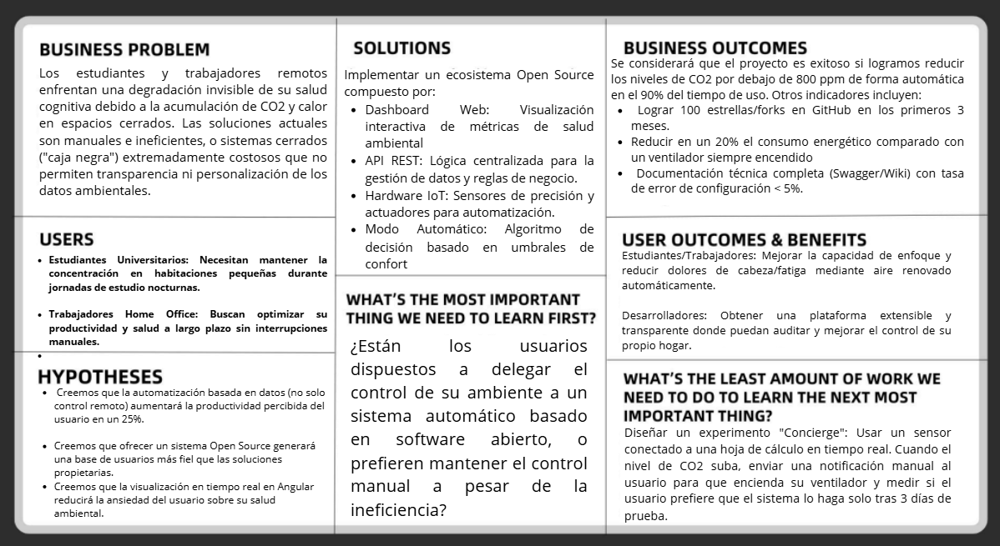

# Capítulo I: Introduccion

La introducción desempeña un papel fundamental en la estructuración y comprensión del proyecto, ya que establece el marco conceptual y contextual sobre el cual se desarrollará el trabajo. En esta sección inicial, se presenta una visión general que permite al lector comprender los objetivos principales que se desean alcanzar, así como los antecedentes que han llevado a la formulación del proyecto. También se delimita el alcance del mismo, es decir, hasta dónde se pretende llegar con el desarrollo de la propuesta. Asimismo, la introducción cumple la función de contextualizar la relevancia del proyecto en un entorno específico, destacando las razones que justifican su realización, los desafíos que se pretenden abordar y los beneficios esperados a partir de su implementación. En suma, esta parte inicial no solo informa, sino que también orienta y motiva al lector a profundizar en el contenido que se presentará a lo largo del documento.

## 1.1. Startup Profile
**Ventix** es una startup tecnológica orientada al desarrollo de soluciones de Bienestar Inteligente (Smart Wellness) bajo el modelo de código abierto. Nuestra misión es democratizar el acceso a tecnologías de control ambiental, permitiendo que cualquier persona u organización pueda implementar sistemas de ventilación automatizados que mejoren la calidad del aire en espacios cerrados.

- **Misión:** Mejorar la salud y productividad de las personas mediante la automatización inteligente del entorno, utilizando software open source y hardware accesible.

- **Visión:** Convertirnos en el framework de referencia para proyectos de automatización ambiental en la comunidad de código abierto para el año 2028.
### 1.1.2. Perfiles de integrantes del equipo
| Foto | Información                                                                                                                                                                                                                                                                                                                                                                                                                                                                                                                                                                                                                                                                                                                 |
|-----|-----------------------------------------------------------------------------------------------------------------------------------------------------------------------------------------------------------------------------------------------------------------------------------------------------------------------------------------------------------------------------------------------------------------------------------------------------------------------------------------------------------------------------------------------------------------------------------------------------------------------------------------------------------------------------------------------------------------------------|
| | **Nombre Completo:**   **Código:**   **Carrera:**    **Perfil:**      **Habilidades Técnicas:**   -   -   -    **Habilidades Sociales:**   -   -   -                                                                                                                                                                                                                                                                                                                                                                                                                                                                                                                           |
| | **Nombre Completo:** Jorge Francisco Taipe Sangama  **Código:** U202313458   **Carrera:** Ingenieria de Software    **Perfil:**   Estudiante de Ingeniería de Software apasionado por el desarrollo de aplicaciones y soluciones tecnológicas mas enfocado en el tema de DevOps    **Habilidades Técnicas:**   - Mandejo de base de datos SQL   - GIT   - Flutter    **Habilidades Sociales:**   - Lider de equipo   - Responsable   - Comunicador                                                                                                                                                                                                                             |
| | **Nombre Completo:** Geraldine Suarez Chinga  **Código:** u20241c804  **Carrera:** Ingenieria de Software   **Perfil:**   Estudiante apasionada en el diseñodel perfil de los sitios web y aplicaciones, centrada en el area del proceso creativo y programacion de juegos    **Habilidades Técnicas:**   -Diseño de aplicacion   -Programacion visual studio promedio    **Habilidades Sociales:**   -Comunicadora   -Responsable   -Activa proactiva                                                                                                                                                                                                                                                                                                                                                                                                                                                                                                                           |
| | **Nombre Completo:**   **Código:**   **Carrera:**    **Perfil:**      **Habilidades Técnicas:**   -   -   -    **Habilidades Sociales:**   -   -   -                                                                                                                                                                                                                                                                                                                                                                                                                                                                                                                           |
| | **Nombre Completo:**   **Código:**   **Carrera:**    **Perfil:**      **Habilidades Técnicas:**   -   -   -    **Habilidades Sociales:**   -   -   -                                                                                                                                                                                                                                                                                                                                                                                                                                                                                                                           |

## 1.2. Solution Profile
### 1.2.1. Antecedentes y problemática
**Antecedentes:**

Históricamente, la ventilación en espacios residenciales pequeños se ha limitado al uso de ventanas o ventiladores mecánicos de control manual. Con el auge del Home Office y la educación a distancia, pasamos hasta el 90% de nuestro tiempo en interiores. Estudios recientes de calidad del aire demuestran que en habitaciones cerradas de menos de 10 $m^2$, los niveles de $CO_2$ pueden duplicarse en menos de una hora, afectando directamente la capacidad cognitiva.

**Problemática:**

El problema central es la invisible degradación del entorno. El ser humano no detecta cambios sutiles en la calidad del aire o la temperatura hasta que el malestar físico (sudoración, somnolencia, falta de concentración) ya está presente. 

Las soluciones actuales son:

- Manuales: Requieren que el usuario interrumpa su flujo de trabajo.

- Costosas: Los sistemas de aire acondicionado centralizado no son accesibles para todos.

- Privadas: Muchas apps de IoT comerciales no son transparentes con los datos del usuario.

**Analisis 5W + 2H:**

**Who? (¿Quién?)**	Estudiantes universitarios y profesionales que realizan trabajo remoto en espacios cerrados o reducidos.

**What? (¿Qué?)**	Deficiente circulación de aire y falta de control térmico automatizado que afecta la salud y productividad.

**Where? (¿Dónde?)**	Habitaciones, oficinas pequeñas y cubículos de estudio con ventilación natural limitada.

**When? (¿Cuándo?)**	Principalmente durante jornadas extendidas de estudio/trabajo y durante las horas de descanso nocturno.

**Why? (¿Por qué?)**	Porque el monitoreo manual es ineficiente y no existen soluciones de bajo costo y Open Source que automaticen el bienestar ambiental.

**How? (¿Cómo?)**	Mediante el despliegue de un ecosistema IoT: sensores recogen datos, un microcontrolador los procesa y una Web App en permite al usuario visualizar y gestionar la automatización.

**How much? (¿Cuánto?)**	El costo de implementación es significativamente menor a un sistema de aire acondicionado, utilizando hardware accesible (ESP32) y software libre.

### 1.2.2. Lean UX Process

El Lean UX es un enfoque que permite validar las soluciones propuestas para problemas identificados. Este enfoque se centra en las personas que utilizarán nuestro producto. Una vez identificada la problemática a resolver, se empleó este proceso para reconocer áreas clave que contribuirán a dar forma al producto propuesto.

#### 1.2.2.1. Lean UX Problem Statements

La problemática central reside en la degradación invisible de la calidad del aire en espacios cerrados, como habitaciones de estudio o pequeñas oficinas, donde la acumulación de dióxido de carbono ($CO_2$) y el aumento de la temperatura ocurren de forma gradual. Al no ser cambios detectables por los sentidos humanos de manera inmediata, el usuario solo percibe el problema cuando ya presenta síntomas de fatiga, somnolencia e irritabilidad, lo que reduce drásticamente su capacidad cognitiva y productividad durante jornadas extendidas de trabajo o estudio.

Actualmente, la gestión de la ventilación en estos entornos es puramente manual y reactiva, lo que obliga al usuario a interrumpir constantemente su "estado de flujo" o concentración para evaluar el ambiente y activar ventiladores o abrir ventanas. Esta interacción física no solo genera distracciones innecesarias, sino que también suele ser ineficiente, ya que el usuario tiende a olvidar apagar los dispositivos una vez alcanzado el confort, resultando en un desperdicio energético acumulado y una gestión deficiente de los recursos.

Desde la perspectiva del desarrollo de software, existe una barrera crítica impuesta por los sistemas de automatización comerciales, los cuales operan bajo protocolos cerrados y propietarios que limitan la soberanía de los datos del usuario. Al ser soluciones de "caja negra", no permiten la personalización de algoritmos de control ni la auditoría del procesamiento de la información, lo que contraviene los principios de transparencia y colaboración necesarios en entornos académicos y profesionales modernos.

Para abordar estos desafíos, surge la necesidad de desarrollar una plataforma Open Source que integre un frontend dinámico con una API REST robusta, capaz de centralizar los datos de sensores IoT. Este sistema no solo busca automatizar el bienestar ambiental mediante decisiones basadas en datos precisos, sino también ofrecer una solución transparente y extensible que permita a la comunidad de desarrolladores mejorar y adaptar el control climático a diversas necesidades de salud y confort.

#### 1.2.2.2. Lean UX Assumptions

**Business Assumptions**

- **Creemos que** existe un mercado creciente de usuarios que valoran la soberanía de sus datos y prefieren soluciones de código abierto sobre ecosistemas cerrados.

- **Creemos que** el bajo costo del hardware (sensores e infraestructura DIY) es el principal motor de adopción para estudiantes y profesionales jóvenes.

- **Creemos que** la transparencia del código (Open Source) generará confianza y permitirá que la comunidad extienda las capacidades del sistema.

**Business Outcomes**

- Lograr un repositorio en GitHub con un alto nivel de documentación que facilite las contribuciones externas (Forks y Pull Requests).

- Establecer una arquitectura modular que pueda ser replicada por otros proyectos de automatización IoT.

- Reducción teórica del consumo energético al optimizar el tiempo de encendido del ventilador basado en datos reales.

**User Assumptions**

- **Creemos que** nuestros usuarios pasan más de 6 horas diarias en espacios reducidos y son conscientes de que el aire estancado afecta su rendimiento.

- **Creemos que** el usuario cuenta con una red WiFi estable y está dispuesto a configurar un microcontrolador básico para mejorar su salud.

- **Creemos que** los usuarios prefieren una interfaz web (Dashboard) que sea accesible desde cualquier dispositivo para monitorear su entorno sin instalar apps pesadas.

**User Outcomes**

- Mejora en la productividad: El usuario experimenta menos episodios de somnolencia y fatiga visual durante sus tareas.

- Confort Térmico Automático: El usuario deja de preocuparse por encender o apagar el ventilador manualmente, delegando esa carga cognitiva al sistema.

- Conciencia Ambiental: El usuario comprende mejor cómo fluctúa la calidad del aire en su hogar gracias a la visualización de datos históricos.

**Features** 

- Dashboard: Panel web interactivo con gráficas en tiempo real de temperatura y $CO_2$.

- Control de Umbrales: Funcionalidad para que el usuario defina a qué niveles de calor o mala calidad de aire se debe activar el sistema.

- API REST Robusta: Backend que centraliza los datos de los sensores y gestiona las reglas de automatización.

- Logs Históricos: Almacenamiento de datos para que el usuario pueda ver el comportamiento de su ambiente durante la última semana o mes.
#### 1.2.2.3. Lean UX Hypothesis Statements
**Hipótesis 1:** 

Automatización y Rendimiento CognitivoCreemos que la implementación de un sistema de activación automática basado en sensores de $CO_2$ para estudiantes y trabajadores remotos resultará en una reducción significativa de la fatiga mental. Sabremos que hemos tenido éxito cuando los reportes de autoevaluación de los usuarios durante las pruebas de validación muestren una mejora del 20% en sus niveles de concentración y energía tras una jornada de 4 horas.

**Hipótesis 2:** 

Visualización de Datos y Conciencia AmbientalCreemos que el desarrollo de un Dashboard dinámico en Angular que visualice métricas de calidad del aire en tiempo real permitirá a los usuarios comprender mejor su entorno doméstico. Sabremos que hemos tenido éxito cuando las analíticas del sistema registren que los usuarios consultan el historial de datos al menos 3 veces al día para ajustar sus hábitos de ventilación manual.

**Hipótesis 3:**

Transparencia y Modelo Open SourceCreemos que proveer una documentación completa de la API REST y el código fuente del frontend para la comunidad de desarrolladores fomentará la transparencia y la extensibilidad del proyecto. Sabremos que hemos tenido éxito cuando el repositorio de GitHub de Ventix reciba sus primeros "Forks" o contribuciones externas (Pull Requests) orientadas a integrar nuevos tipos de sensores o funcionalidades.

**Hipótesis 4:** 

Eficiencia de Control y Latencia del SistemaCreemos que el uso de una arquitectura basada en microservicios para gestionar la comunicación entre el hardware y la web garantizará una respuesta inmediata del ventilador ante condiciones críticas. Sabremos que hemos tenido éxito cuando el tiempo transcurrido entre la detección de un nivel de $CO_2$ superior a las 800 ppm y la activación física del actuador sea menor a 5 segundos.
#### 1.2.2.4. Lean UX Canvas

## 1.3. Segmentos objetivo
El proyecto Ventix se dirige a usuarios que pasan gran parte de su día en entornos interiores de dimensiones reducidas, donde el control de la calidad del aire es crítico para su desempeño. Se han identificado los siguientes dos segmentos principales:

**1. Estudiantes universitarios en espacios cerrados:** 

Este segmento comprende a jóvenes de entre 18 y 25 años que residen en dormitorios universitarios, habitaciones alquiladas o departamentos compartidos.

- **Contexto:** Suelen estudiar en habitaciones pequeñas que carecen de sistemas de ventilación centralizada.

- **Puntos de dolor:** Experimentan fatiga, somnolencia y pérdida de concentración durante sesiones de estudio nocturnas o extendidas debido a la acumulación de $CO_2$.

- **Necesidad:** Requieren una solución económica y fácil de instalar que les permita mantener un ambiente fresco de forma automática para no interrumpir su flujo de aprendizaje.

**2. Trabajadores en modalidad Home Office:**

Este perfil incluye a profesionales (principalmente del sector tecnológico y administrativo) que han trasladado su oficina al hogar.

- **Contexto:** Pasan jornadas de 8 horas o más frente al computador, a menudo en habitaciones que permanecen cerradas para evitar ruidos externos o mantener la temperatura.

- **Puntos de dolor:** Dolores de cabeza frecuentes y cansancio acumulado al final del día causados por la mala renovación del aire. Valoran la productividad y evitan interrupciones manuales.

- **Necesidad:** Una plataforma web (Dashboard) que les dé seguridad sobre la salud de su entorno y un sistema que actúe por sí solo, permitiéndoles enfocarse al 100% en sus metas laborales.
